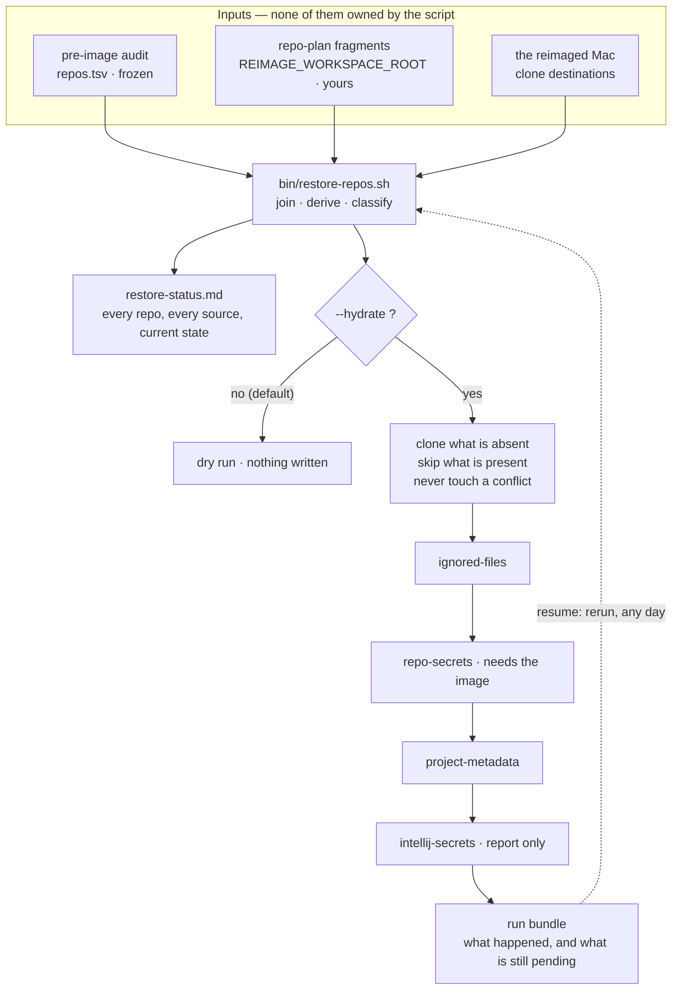
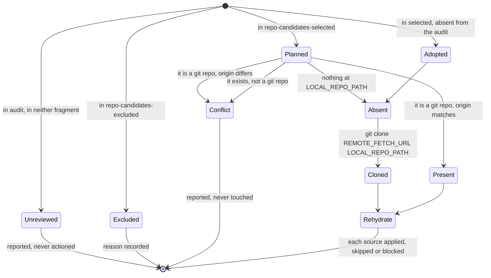

# Restore Repositories — clone plan architecture

**Status:** design, not built. Nothing in this document exists yet.
**Written:** 2026-09-02, Restore Repositories Refactor session.
**Revised:** 2026-09-02 after owner review — see *What changed in this revision*.
**Concerns:** Phase 11B, `restore-repos.md`, `bin/restore-repos.sh`.

Phase 11B today clones the pre-image inventory verbatim into two roots, one
directory per repository, named `basename`. This describes what replaces that: a
declared plan, read at run time, that survives partial runs and grows a new
rehydration source without a code change.

---

## Table of Contents

- [[#What changed in this revision|What changed in this revision]]
- [[#Why the emitted script cannot carry this|Why the emitted script cannot carry this]]
- [[#The shape|The shape]]
- [[#Deriving what can be derived|Deriving what can be derived]]
- [[#The fragment set|The fragment set]]
- [[#End to end|End to end]]
- [[#Per-repository resolution|Per-repository resolution]]
- [[#Idempotency and partial runs|Idempotency and partial runs]]
- [[#What this replaces|What this replaces]]
- [[#Open decisions|Open decisions]]

---

## What changed in this revision

The first draft got one thing wrong and several things vague.

**Wrong: the IntelliJ project keys are derivable.** The draft said the mapping
"cannot be computed" and built the fragment set around that. It can be computed —
`project-metadata/<path>` is the repository's pre-image path relative to the
scanned projects root. The map fragment drops from *the primary mechanism* to
*an override for exceptions*.

**Wrong: the worked example.** `$GIT_WORK_REPO_ROOT/ingestion/ingestion-listener`
does not correspond to anything. The real pre-image path is
`IdeaProjects/apicoe/ingestion-listener`.

**Changed: fragments are declarative function calls, not delimited rows.** Named
keys, order-free, validated at load, extensible without rewriting existing
entries.

**Changed: field names.** `LABEL` was doing three jobs and is now `REPO_NAME`.
Full set below.

**Added: a fourth rehydration source.** The Phase 3C image carries an `intellij`
category alongside `repos-gitignored`, confirmed in its category manifest.

---

## Why the emitted script cannot carry this

The current design resolves everything at emission time and writes three shell
scripts into the run bundle. That works while the answer per repository is one
URL and one directory. It stops working for three reasons.

**A snapshot goes stale.** `clone-commands.sh` encodes the plan as it was the
moment it was generated. Edit the plan a week later and the file on disk is
wrong, but still runnable.

**Editing the emitted script is lost work.** `restore-repos.md` Step 2 says to
review and edit `clone-commands.sh`; Step 9 says to rerun the script, which
overwrites it. Every hand edit is discarded by the next run.

**Restoring a repository is not one copy.** After the clone, content comes back
from four places:

| Source | Lives in | Keyed by |
|---|---|---|
| Reviewed kept ignored files | `staged-ignored-files/live/<repo>/` | repository name |
| Gitignored secrets | `repos-gitignored/<repo>/` in the Phase 3C image | repository name |
| IntelliJ project metadata | `app-settings-backup/intellij/project-metadata/<path>/` | pre-image path under the projects root |
| IntelliJ HTTP Client secrets | `intellij/` in the Phase 3C image | to be confirmed when the image is next attached |

Two key spaces, one of them derivable from the other, and one source that is only
reachable while the image is mounted. That is a registry, not a hardcoded list —
and the fourth row is a source that appeared *after* the first draft was written,
which is the argument for the registry made better than any principle.

---

## The shape

```text
INPUT: evidence                    INPUT: declaration
  repo-audit-reports/                $REIMAGE_WORKSPACE_ROOT/repo-plan/
  runs/pre-image-*/repos.tsv           *.conf.sh fragments
  (frozen, from Phase 2A)              (yours, survives the reimage)
             \                              /
              \                            /
               v                          v
            bin/restore-repos.sh  -- reads both, reads DISK,
                                    reports or applies
                          |
                          v
            OUTPUT: the reimaged Mac + a run bundle recording what happened
```

### The command surface

```bash
./bin/restore-repos.sh                          # status run: reads, writes the bundle, mutates nothing
./bin/restore-repos.sh --dry-run                # prints; writes nothing at all
./bin/restore-repos.sh --hydrate                # status run, then clone and every source
./bin/restore-repos.sh --hydrate --dry-run      # what --hydrate would do; writes nothing
./bin/restore-repos.sh --hydrate --stage clone  # the cloner alone
./bin/restore-repos.sh --hydrate --stage ignored-files --stage project-metadata
```

`--dry-run` means *write nothing anywhere*, matching every other script in the
repository, and it composes with `--hydrate` rather than replacing it.

`--stage` is repeatable and takes `clone` **or any `ARTIFACT_TYPE`**, so running
the cloner alone and running one source alone are the same mechanism rather than
two flags. Omitted, every stage runs.

`--apply-ignored-files` is replaced by `--hydrate --stage ignored-files`. No
compatibility flag: the old name did one source's job under a name that implied
all of them.

**On `--hydrate` beside `repo-rehydration-sources.conf.sh`.** The `re-` looks
like an inconsistency and is not one. The action is `--hydrate` and its evidence
is `hydrated.md`; the *sources* are rehydration sources because what they hold is
material being put back. And the distinction the prefix seems to draw does not
exist — as the owner put it, deciding this: *there is no first time, and every
drink after is a re-hydration.* A working tree is never hydrated once; it is
filled, emptied by a reimage, and filled again. Which is also why there is one
`hydrated.md` rather than a first-time file and a subsequent one.

The audit says what **existed**. The plan says what you **want** and where. Disk
says what is **already there**. The script owns none of those facts — it joins
them, and every run re-joins them from scratch. That is what makes it resumable:
there is no state to go stale, because there is no state.

Fragments live at `$REIMAGE_WORKSPACE_ROOT/repo-plan/`, seeded once from
`.internal/templates/repo-plan/`, following the convention `artifact-config`,
`staged-certs` and `intellij-review` already use. They are sourced, so a path
written as `$LOCAL_WORK_REPO_ROOT/apicoe` expands.

---

## Deriving what can be derived

The plan should declare judgment, not restate evidence. Three of the four fields
a clone needs are already in the audit, and the IntelliJ key falls out of it too.

### The remote comes from column 4, and needs no parsing

Since Revision 131 the `remote_urls` cell is one `name url (fetch|push)` per
`;`-separated segment:

```text
origin https://github.gaig.com/CloudNativeApps/ingestion.git (fetch);origin https://…(push)
```

`REMOTE_NAME` and `REMOTE_FETCH_URL` come straight from there. The branch is
column 2. Column 3 — the decorated HEAD line — is read only for its leading SHA,
and never parsed for anything else.

That matters because column 3 looks fragile and is not load-bearing:

```text
33264a7 (HEAD -> master, origin/master, origin/HEAD) added gateway-monitoring…
e32cc00 (HEAD -> mlMultiNodeCluster, orah/mlMultiNodeCluster) Added a …
```

The upstream remote *is* in that decoration, and it is the one thing only the
decoration knows. It is not worth parsing for: `REMOTE_NAME` defaults to `origin`
and is stated explicitly in the fragment when it is something else — three
repositories on this machine (`shiva`, `orah`, `omkara`).

### The IntelliJ key is the pre-image path, minus the scanned root

`app-settings-backup/intellij/README.md` records the projects root it walked, and
`repos.tsv` column 1 holds each repository's absolute pre-image path. The
metadata key is the difference:

| `repos.tsv` column 1 | `project-metadata/` key |
|---|---|
| `…/Development/IdeaProjects/apicoe/ingestion` | `apicoe/ingestion` |
| `…/Development/IdeaProjects/tools/copilot` | `tools/copilot` |
| `…/Development/IdeaProjects/transformation-tool/scripts` | `transformation-tool/scripts` |
| `…/Development/IdeaProjects/module-selector-plugin` | `module-selector-plugin` |
| `…/Development/documentation/fractogenesis-toolkit` | *(none — not an IntelliJ project)* |

Measured: 22 `.idea` directories under `project-metadata/`, 18 of them at a key
that matches a repository derived this way. The other four — `apicoe`, `tools`,
`transformation-tool`, `data-cache-related` — are **container projects**: IntelliJ
projects that group several repositories, with their own `.idea` belonging to no
single repository. Nine audit repositories have no metadata: the four under
`documentation/`, plus five that were never opened as IntelliJ projects.

So the map fragment exists for the cases the derivation gets wrong, not for the
27 it gets right. A container project's `.idea` is restored, if at all, by an
explicit entry naming where the operator wants it.

`staged-ignored-files/live/` and `repos-gitignored/` both key on the repository
name directly. The `documentation` and `IdeaProjects` entries under `live/` are
parent-root bundles that no repository lookup reaches — a separate parked gap.

---

## The fragment set

**Declarative function calls, not delimited rows.** Each entry is a call with
named keys. Order-free, blank-tolerant, extensible without rewriting existing
entries, and a typo is caught at load time and named:

```text
repo_plan_add: unknown key REMOTE_URL (repository: ingestion)
```

rather than becoming a silently shifted column — which is what this phase spent
Revision 131 recovering from.

### Field names

| Field | Meaning |
|---|---|
| `REPO_NAME` | The repository's name. The key for `staged-ignored-files/live/` and `repos-gitignored/`, and the default clone directory name |
| `REMOTE_NAME` | Short name of the configured remote to clone from. Default `origin` |
| `REMOTE_FETCH_URL` | That remote's fetch URL. Default: looked up in the audit by `REPO_NAME` + `REMOTE_NAME` |
| `LOCAL_REPO_PATH` | Where it lands: a root expanded with a path, e.g. `$LOCAL_WORK_REPO_ROOT/apicoe/ingestion`. Default `$LOCAL_WORK_REPO_ROOT/$REPO_NAME` by routing |
| `ARTIFACT_TYPE` | Which rehydration source a map entry is about |
| `ARTIFACT_ROOT` | A source's root — `$REIMAGE_ARTIFACT_ROOT` or `$DMG_MOUNT`, plus a path |
| `ARTIFACT_SUBPATH` | The key under that root, when it is not `REPO_NAME` |

`DEST` survives as script-local shorthand and never appears in the contract.

### `repo-candidates-selected.conf.sh` — what to clone, and where

```bash
repo_plan_add \
  REPO_NAME=ingestion \
  LOCAL_REPO_PATH="$LOCAL_WORK_REPO_ROOT/apicoe/ingestion"

repo_plan_add \
  REPO_NAME=carrier-services-storage \
  REMOTE_NAME=origin \
  LOCAL_REPO_PATH="$LOCAL_WORK_REPO_ROOT/apicoe/carrier-services-storage"

repo_plan_add \
  REPO_NAME=fractogenesis-toolkit \
  REMOTE_NAME=shiva \
  LOCAL_REPO_PATH="$LOCAL_PERSONAL_REPO_ROOT/fractogenesis-toolkit"
```

Only `REPO_NAME` is required. Everything else defaults from the audit and the
routing rule, so a repository going to its routed root under its own name is one
line.

### `repo-candidates-excluded.conf.sh` — what you decided not to clone

```bash
repo_plan_exclude \
  REPO_NAME=transformer-tool-notes \
  REASON="archived 2025; content folded into reference-vault"
```

Not the same as leaving an entry out. `bin/record-restore-exit.sh` carries a
manual row — *"Repositories left unrestored are a decision"* — and this is the
file that answers it. Absence cannot.

A repository in the audit and in neither fragment is **unreviewed**: reported
every run, never cloned, never silently skipped. A default action would turn a
repository nobody decided about into one that quietly went missing.

### `repo-rehydration-sources.conf.sh` — where post-clone content comes from

```bash
repo_source_add \
  ARTIFACT_TYPE=ignored-files \
  ARTIFACT_ROOT="$REIMAGE_ARTIFACT_ROOT/staged-ignored-files/live" \
  KEYED_BY=repo-name  REQUIRES=artifact-root  MODE=merge \
  DESCRIPTION="Reviewed kept ignored files from Phase 2A"

repo_source_add \
  ARTIFACT_TYPE=repo-secrets \
  ARTIFACT_ROOT='$DMG_MOUNT/repos-gitignored' \
  KEYED_BY=repo-name  REQUIRES=dmg  MODE=merge \
  DESCRIPTION="Gitignored secret-shaped files, encrypted into the Phase 3C image"

repo_source_add \
  ARTIFACT_TYPE=project-metadata \
  ARTIFACT_ROOT="$REIMAGE_ARTIFACT_ROOT/app-settings-backup/intellij/project-metadata" \
  KEYED_BY=pre-image-path  PATH_ROOT="$PRE_IMAGE_PROJECTS_ROOT" \
  REQUIRES=artifact-root  MODE=merge \
  DESCRIPTION="Per-project .idea metadata, keyed by path under the pre-image projects root"

repo_source_add \
  ARTIFACT_TYPE=intellij-secrets \
  ARTIFACT_ROOT='$DMG_MOUNT/intellij' \
  KEYED_BY=declared  REQUIRES=dmg  MODE=report \
  DESCRIPTION="IntelliJ HTTP Client environment files; layout to confirm when the image is next attached"
```

`KEYED_BY` is the derivation, and it is what the first draft got wrong by not
having:

- `repo-name` — the bundle directory is `REPO_NAME`
- `pre-image-path` — the key is column 1 relative to `PATH_ROOT`
- `declared` — no derivation; only reachable through the map

`MODE=report` on the fourth source is deliberate: its layout has not been seen,
so it lists what it finds and restores nothing until someone has looked.

Adding a fifth source is one call here. No script change.

### `repo-rehydration-map.conf.sh` — overrides only

```bash
repo_map_add \
  REPO_NAME=ingestion-related \
  ARTIFACT_TYPE=project-metadata \
  ARTIFACT_SUBPATH=ingestion-related

repo_map_add \
  REPO_NAME=apicoe-container \
  ARTIFACT_TYPE=project-metadata \
  ARTIFACT_SUBPATH=apicoe \
  LOCAL_REPO_PATH="$LOCAL_WORK_REPO_ROOT/apicoe"
```

Empty on a machine where every derivation is right. It exists for the container
projects, for a repository whose pre-image path moved between the audit and the
reimage, and for any source whose bundle is not shaped like a repository root.

---

## End to end



The dotted edge is the whole design. A run ends wherever you ran out of time, and
the next run re-derives everything and picks up what is left.

---

## Per-repository resolution

Every run computes this fresh, for every repository, from disk.



**`Present` is not `[ -d .git ]`.** It requires `git -C … remote get-url origin`
to equal `REMOTE_FETCH_URL`. That comparison separates *already done* from
*something else is sitting there* — and a directory holding a different
repository is the failure a bare `-d` test reports as success.

**`Adopted`** is a repository added to the plan that the pre-image audit never
saw. Legal: the plan is authoritative for what to clone, the audit for
carry-forward. It clones normally, and its carry-forward reports `n/a` rather
than `0` — different facts.

Per source, per repository:

| | |
|---|---|
| `applied` | bundle found and merged |
| `skipped` | no bundle for this key — normal; nine repositories have no IntelliJ metadata |
| `blocked` | source requires the image and it is not attached |
| `pending` | repository not cloned yet, so there is nowhere to merge into |

---

## Idempotency and partial runs

The phase is assumed to be walked over several sittings.

**Clones.** `Absent` clones, `Present` reports and does nothing, `Conflict` is
never touched. Stop after nine of twenty-five and the next run says `ok` nine
times and clones the other sixteen. Nothing is cloned twice, because *cloned* is
asked of disk every run rather than remembered from the last one.

**Post-clone actions run only on the branch that just cloned.** `git checkout
<pre-image branch>` is safe on a fresh clone and destructive on a repository
worked in for three days. The remote-add lines are naturally idempotent and could
run either way; the checkout decides the rule, so all of them stay inside the
clone.

**Rehydration is replay-safe.** `rsync -a` is mtime-based and leaves a newer file
alone. A source that cannot be reached is `blocked`, not failed — attach the
image next Tuesday and rerun.

**No ledger.** The plan plus `git remote get-url origin` at each destination is a
complete answer computed fresh. A ledger is a second source of truth whose
failure mode is silent: it reports `cloned` for a directory that was deleted.

**Nested destinations** need `mkdir -p "$(dirname "$LOCAL_REPO_PATH")"` before the
clone, and `git clone "$URL" "$LOCAL_REPO_PATH"` rather than `cd "$ROOT" && git
clone` — which also removes the `cd` that Step 3 warns about as a
directory-scoped `direnv` hazard.

**No nested command substitution inside a here-document.** Every report cell is
computed into a variable first. That construct is the suspected cause of three
0-byte `restore-status.md` files on the volume; see the parked note.

---

## What this replaces

| Today | Becomes |
|---|---|
| `clone-commands.sh`, emitted then hand-edited | fragments, edited once and reused; `hydrated.md` records what ran |
| `rsync-ignored-files.sh` | the `ignored-files` source |
| `rsync-repos-gitignored.sh` | the `repo-secrets` source |
| nothing | `project-metadata` and `intellij-secrets` |
| `--apply-ignored-files` | `--hydrate --stage ignored-files` |
| Step 2 "review the emitted clone commands" | Step 2 "review the plan" |
| duplicate-basename guard | `LOCAL_REPO_PATH` collision **and** `REPO_NAME` collision, separately |

The duplicate guard has to split. Two repositories sharing a name become legal
once their paths differ — but they still collapse to one bundle key, and merging
one bundle into two working trees is how work credentials reach a repository that
gets pushed publicly. Different question, different check.

`bin/restore-repos.sh` stays an aggregate validator: it mutates nothing without
`--hydrate`, and records PASS/WARN/FAIL rows rather than aborting on first
failure.

---

## Open decisions

**1. The emitted scripts. DECIDED 2026-09-02 — replaced by a record.**
`clone-commands.sh`, `rsync-ignored-files.sh` and `rsync-repos-gitignored.sh` are
gone. In their place the bundle carries **`hydrated.md`**: what this run did, per
repository and per stage, including the stages it was not asked to run.

Keeping them runnable would have left two ways to clone, which is the duplicated
path this design exists to remove. Dropping them without a replacement would have
lost the record of what a partial run accomplished — and this phase is expected to
be walked over several sittings, so that record is the thing that makes the next
sitting legible.

A status run with no `--hydrate` still writes `hydrated.md`, saying no actions
were taken and naming every stage that did not run. "Nothing happened" and
"nothing needed to happen" are different answers, and an empty section cannot
tell them apart.

**One file, one name — not `hydration.md` and `rehydration.md`.** First-time and
subsequent are not properties of a *run*: one run clones sixteen repositories and
finds nine already present, so both happen at once and the distinction is
per repository. It is already carried by the per-repo state — `Absent → Cloned`
against `Present` — and by the per-stage outcome.

The run directory is what separates one sitting from the next, so a varying
filename would be a second mechanism for what the run id already answers. And
`restore-repos.md` states that a bundle's filenames are stable across runs, which
is what lets anything read a bundle by path; a name that depends on circumstance
means opening the directory to discover which file to look for. The rest of the
tree names per-run artifacts the same way — `comparisons/*/comparison.md`.

**2. A domain index. DECIDED 2026-09-02 — a sibling.**
`repo-audit-reports/repo-restore-index.md`, beside `MANIFEST.md` and
`repo-audit-index.md`, one row per `post-image-restore` run: planned, cloned,
present, conflict, unreviewed, and a per-source applied / skipped / blocked /
pending summary.

Follows Revision 141's precedent — when the shared manifest schema cannot carry a
category's columns, a domain index goes beside it rather than widening it.
Extending `repo-audit-index.md` was rejected because its columns are pre-image
*audit* counts and these are post-image *restore* counts: every row would blank
one half. The value is cross-run: a phase walked over several sittings needs
"am I getting closer" answered without opening each bundle in turn.

**3. `record-restore-exit.sh` row 3** grades *"each repository sits under the root
matching its remote"*, so a deliberate `LOCAL_REPO_PATH` outside the work root
fails it. Either the recorder reads the plan, or a deliberate placement becomes a
recorded decision. That file is outside this file set — flagged, not extended.

**4. `restore-repos.md` Step 4** hardcodes the toolkit's clone path. Once the plan
can move the toolkit, Step 4 takes it from the plan. Runbook-side; recorded for
the owner's runbook pass.

**5. `LOCAL_WORK_REPO_ROOT` / `LOCAL_PERSONAL_REPO_ROOT`.** Proposed rename from
`GIT_*_REPO_ROOT` — they are filesystem locations, not GitHub anything, and they
legitimately differ pre- and post-image. 200 occurrences across 25 files; 185
across 24 once `APPLY-MANIFEST.md` is excluded, since it is never retro-edited.
`backup-repos.md` Step 1 owns the naming contract and is where it starts. The
other eleven `GIT_*` keys stay as they are. **Owner's call, and it should land
before the fragments quote the new names.**
